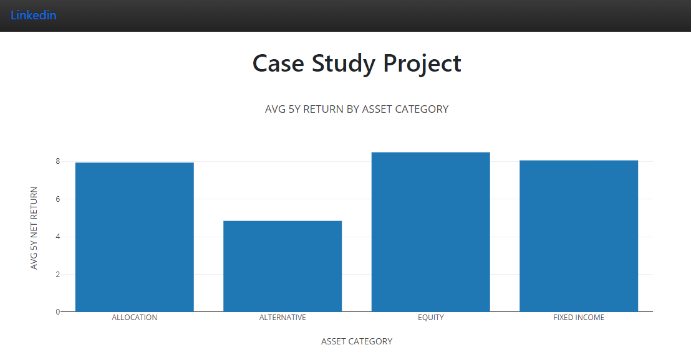

# DOCKER_WEB_APP

***
## Project Description

The goal of the project is to create a Flask web app and containerize the app using docker.

## Files

- **app** - Folder containing project
    - **data** -Folder of data used in web app chart
    - **static** - Folder for css and javascript used in the project
    - **templates** - Jinja Template for html web page
    - **app.py** - python script for Flask
    - **requirements.txt** - Python libraries for project
- **img** - Picture for the project
- **Dockerfile** - Script to create docker docker web app

**Step 1** 

- Change directory and build docker image with the below command

cd DOCKER_WEB_APP

docker build -t web_app .

**Step 2** 

- Run the docker image with the name flask_container and exposing port 5000

docker run -d --name flask_container -p 5000:5000 web_app

**Step 3**

- Click open in the browser on docker dashboard

**Step 4**

- Flask web app

